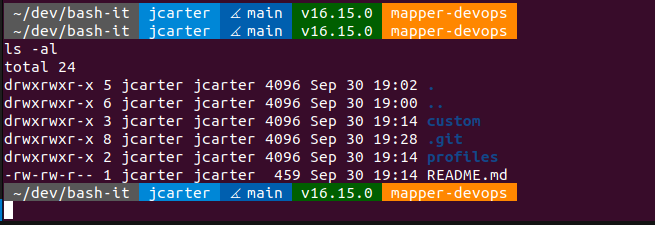

# bash-it

</img>

- CLI Shows `PWD USER BRANCH+STATUS NODE_VERSION AWS_PROFILE`
- Auto calls `nvm use on change into dir with .nvmrc`.
- Profile with preselected packages, etc.
- Some aliases.

### Instructions:
1. Install `bash-it` per https://github.com/Bash-it/bash-it#installation
1. Paste the files in this repo into their relative locations inside `~/.bash_it`.
1. Run `bash-it profile load jc`.
1. Edit `BASH_IT_THEME` inside `~/.bashrc` to `'jc'`.
1. Run `bash-it reload`.
